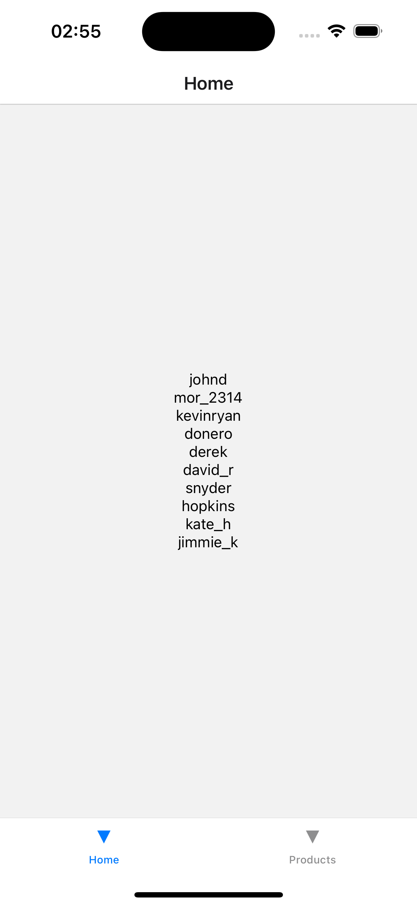
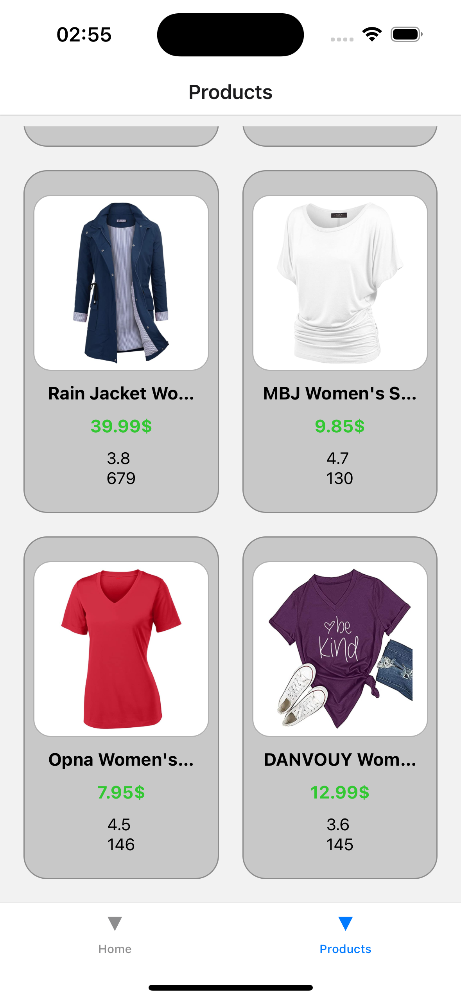
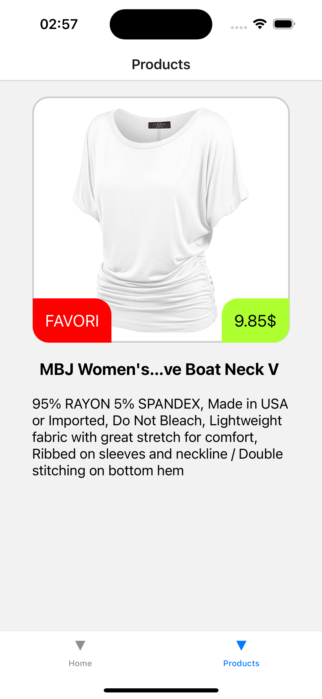
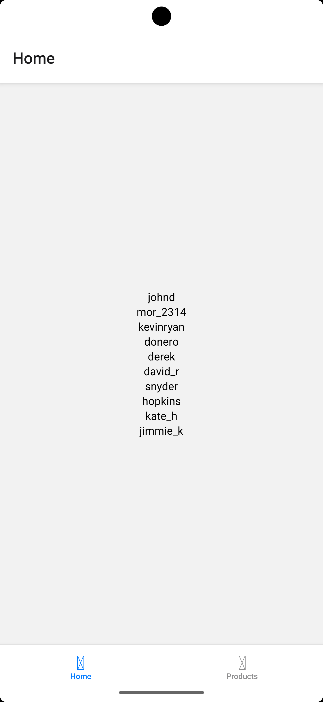
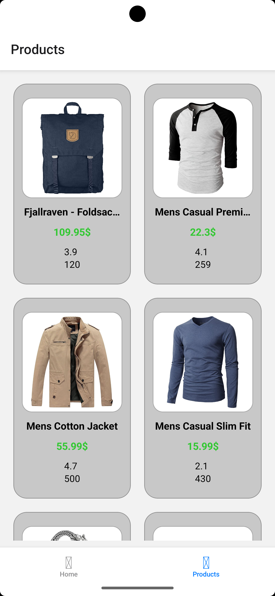

# RNSQLLITE - React Native E-Ticaret Uygulaması

Bu proje, React Native kullanılarak geliştirilmiş modern bir e-ticaret mobil uygulamasıdır. Redux Toolkit ile state yönetimi, React Navigation ile sayfa geçişleri ve FakeStore API ile ürün verilerini kullanmaktadır.

## 🚀 Özellikler

- **Ürün Listesi**: Kategorilere göre ürünleri görüntüleme
- **Ürün Detayları**: Ürün hakkında detaylı bilgi görüntüleme
- **Favori Sistemi**: Ürünleri favorilere ekleme/çıkarma
- **Kullanıcı Yönetimi**: Kullanıcı listesi ve profil bilgileri
- **Modern UI/UX**: Kullanıcı dostu arayüz tasarımı
- **Redux State Yönetimi**: Merkezi state yönetimi
- **Navigation**: Tab ve Stack navigasyon sistemi

## 📱 Ekranlar

### Ana Ekranlar
- **Home Screen**: Kullanıcı listesi ve profil bilgileri
- **Products Screen**: Ürün listesi (2 sütunlu grid görünüm)
- **Product Details**: Ürün detay sayfası

### Navigasyon Yapısı
```
Root Navigator (Tab Navigator)
├── Home Tab
│   └── HomeScreen
└── Products Tab
    └── Product Navigator (Stack Navigator)
        ├── ProductsScreen
        └── ProductDetails
```

## 🛠️ Teknolojiler

- **React Native**: 0.80.1
- **React**: 19.1.0
- **Redux Toolkit**: 2.8.2
- **React Navigation**: 7.x
- **Axios**: HTTP istekleri için
- **TypeScript**: Tip güvenliği

## 📦 Kurulum

### Gereksinimler
- Node.js >= 18
- React Native CLI
- Android Studio (Android için)
- Xcode (iOS için)

### Adım 1: Projeyi Klonlayın
```bash
git clone <repository-url>
cd RNSQLLITE
```

### Adım 2: Bağımlılıkları Yükleyin
```bash
npm install
```

### Adım 3: iOS Bağımlılıkları (Sadece iOS için)
```bash
cd ios
bundle install
bundle exec pod install
cd ..
```

### Adım 4: Metro'yu Başlatın
```bash
npm start
```

### Adım 5: Uygulamayı Çalıştırın

**Android için:**
```bash
npm run android
```

**iOS için:**
```bash
npm run ios
```

## 🏗️ Proje Yapısı

```
RNSQLLITE/
├── src/
│   ├── navigators/          # Navigasyon bileşenleri
│   │   ├── RootNavigator.jsx
│   │   └── ProductNavigator.jsx
│   ├── redux/              # Redux store ve slice'lar
│   │   ├── store.js
│   │   └── slices/
│   │       ├── productSlice.js
│   │       └── userSlice.js
│   └── screens/            # Uygulama ekranları
│       ├── HomeScreen.jsx
│       ├── ProductsScreen.jsx
│       └── ProductDetails.jsx
├── App.tsx                 # Ana uygulama bileşeni
└── package.json
```

## 🔧 Redux Store Yapısı

### Products Slice
```javascript
{
  items: [],        // Ürün listesi
  favorites: [],    // Favori ürün ID'leri
  isLoading: false, // Yükleme durumu
  error: null       // Hata durumu
}
```

### Users Slice
```javascript
{
  users: [],        // Kullanıcı listesi
  isLoading: false, // Yükleme durumu
  error: null       // Hata durumu
}
```

## 📡 API Entegrasyonu

Proje, FakeStore API'sini kullanarak gerçek ürün verilerini çeker:

- **Ürünler**: `https://fakestoreapi.com/products`
- **Kullanıcılar**: `https://fakestoreapi.com/users`

### API Özellikleri
- Ürün resimleri, fiyatları, açıklamaları
- Kullanıcı profil bilgileri
- Rating ve değerlendirme sayıları

## 🎨 UI/UX Özellikleri

### Ürün Kartları
- 2 sütunlu grid düzeni
- Ürün resmi, başlık, fiyat
- Rating bilgileri
- Dokunmatik etkileşim

### Ürün Detay Sayfası
- Büyük ürün resmi
- Fiyat bilgisi
- Favori ekleme/çıkarma butonu
- Detaylı açıklama

### Navigasyon
- Bottom Tab Navigator
- Stack Navigator (ürün detayları için)
- Smooth geçişler

## 🔄 State Yönetimi

### Redux Toolkit Kullanımı
- `createSlice`: State ve reducer'ları tanımlama
- `createAsyncThunk`: API çağrıları için
- `useSelector`: State'e erişim
- `useDispatch`: Action'ları dispatch etme

### Örnek Kullanım
```javascript
// State'e erişim
const { items, favorites } = useSelector(state => state.products);

// Action dispatch etme
const dispatch = useDispatch();
dispatch(fetchProducts());
dispatch(toggleFavorite(productId));
```

## 🚀 Geliştirme Komutları

```bash
# Metro'yu başlat
npm start

# Android'de çalıştır
npm run android

# iOS'ta çalıştır
npm run ios

# Lint kontrolü
npm run lint

# Test çalıştır
npm test
```

## 🐛 Hata Ayıklama

### Yaygın Sorunlar

1. **Metro Cache Temizleme**
```bash
npx react-native start --reset-cache
```

2. **iOS Pod'ları Yeniden Yükleme**
```bash
cd ios
pod deintegrate
pod install
cd ..
```

3. **Android Clean Build**
```bash
cd android
./gradlew clean
cd ..
```

## 📱 Platform Desteği

- ✅ iOS (iOS 12.4+)
- ✅ Android (API Level 21+)

## 🔮 Gelecek Özellikler

- [ ] Sepet sistemi
- [ ] Ödeme entegrasyonu
- [ ] Kullanıcı girişi/kaydı
- [ ] Ürün arama
- [ ] Kategori filtreleme
- [ ] Offline desteği
- [ ] Push bildirimleri

## 🤝 Katkıda Bulunma

1. Fork yapın
2. Feature branch oluşturun (`git checkout -b feature/amazing-feature`)
3. Commit yapın (`git commit -m 'Add amazing feature'`)
4. Push yapın (`git push origin feature/amazing-feature`)
5. Pull Request oluşturun

## 📄 Lisans

Bu proje MIT lisansı altında lisanslanmıştır.

## 👨‍💻 Geliştirici

Bu proje React Native öğrenme amaçlı geliştirilmiştir.

---

**Not**: Bu uygulama eğitim amaçlı geliştirilmiştir ve gerçek e-ticaret işlemleri için kullanılmamalıdır.

## 🖼️ Örnek Ekranlar

### iOS

| Ana Ekran                | Ürün Listesi              | Ürün Detayları            | Genel Uygulama           |
|--------------------------|---------------------------|---------------------------|--------------------------|
|  |  |  |  |

### Android

| Ana Ekran                | Ürün Listesi              |
|--------------------------|---------------------------|
|  |  |
